```{r setup, include=FALSE}
knitr::opts_chunk$set(echo = FALSE)
```

# 1. Introduction 

International merchandise trade statistics are indicative of Singapore's competitiveness in the global economic system. 
Our top trading countries, as consumers and producers, are important partners for economic growth and stabilty. 

In this data visualisation makeover, we are tasked to explore and revise the stacked area chart created by data from the Department of Statistics, Singapore (DOS), for merchandise trade shown below. 


[Source](https://www.singstat.gov.sg/find-data/search-by-theme/trade-and-investment/merchandise-trade/latest-data)

# 2. Evaluation of Original Visualisation 

We start by exploring the original visualisation in terms of **clarity** and **aesthetics**. 

## 2.1 Clarity

1. The title of the graph is inaccurate and vague. Firstly, the title does not indicate if the these countries are top six in terms of Exports or Imports. Next, closer inspection of the dataset reveals that these countries are not top in terms of Exports or Imports.

Exports |  Imports
--------|----------
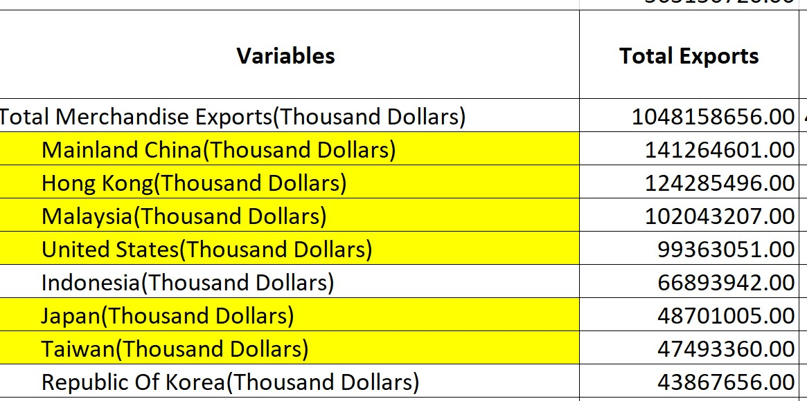{width=300px} | {width=300px}

2. There are two y-axes provided for each sub-plot and each y-axis is scaled differently for Exports and Imports, making it difficult to compare the country's Exports and Imports. The y-axes are also scaled differently across the sub-plots, making comparisons between countries difficult. 

4. The x-axes are not scaled proportionally for comparison. In particular, Japan has only one year's of trade statistics displayed. The other countries has two year's data but the different lengths of the x-axis makes Mainland China and Malaysia appear longer than the rest. 

5. The label of the x-axes indicate months but only the years are shown. This makes it difficult to tell if there are missing dates in data that are causing the x-axis to be shorter for some countries. 

6. The sub-graphs do not appear as if they are ordered in any meaningful way. Countries could be ordered from first to last to better reflect the title. 


## 2.2 Aesthetic

1. There is poor use of stacked area chart and colours. As there are many overlapping regions and they are coloured differently, it appears as if there are three measures for each sub-graph.

2. The sub-title of each sub-graph is not aligned to the center of each sub-graph.

3. No tick marks are used on the y-axes even though they are of a continuous numerical scale.

4. The x-axis is labeled at the start of each year instead of the middle even though it is for a categorical scale. This results in the graph appearing as if it spans from mid-2019 to mid-2021.

4. The title is of a smaller font size than the names of countries when it should be the emphasis for this visualization. 

# 3. Proposed Representation 

The proposed design is as follows.


## 3.1 Clarity 

1. Title and sub-title 
Sets the context of the visualization. Since this is about trade, major events that have affected trade would be mentioned  here to set the context to  understanding the visualization. As the countries are not the top 6, we will just name them as the top countries. 
2. The main panel shows a quick summary for easy comparison between countries across the two years. The right panel presents a detailed look into the trends which would be otherwise lost in the summarized view. To make the appearance less cluttered we will make use of the pop-up boxes to display the values of points of interest. 
3. X-axis showing both dates and countries allow for easy comparison across both dimensions. 
3. Y-axis shows the relative value of Exports and Imports with their difference being the Balance of Trade. This allows reads to quickly assess which countries have contributed more in terms of overall trade balance.
5. Choice of a Gantt bar chart shows the relationship between the variables in a simple summary. The detailed time series will show the impact of major events on trade and the trend lines for a more in depth understanding of each country. 

## 3.2 Aesthetic

1. Colour used to differentiate between Exports and Imports and bring attention the growth trends. 
2. A gradient colour for Balance of Trade allow for quick interpretation of positive or negative periods. 
3. Set the detailed time series graph to be smaller than the main summary to lend more emphasis to the summary. 
4. Coordinate the colours in both charts so that it is more intuitive to read and earlier to interpret the association between them.  
5. Use reference lines are used judicially to direct attention to what is important for comparison. 

# 4. Step-by-Step Guide

## Data Cleaning

1. Open the data file in Excel. Extract only the relevant countries (Mainland China, Malaysia, United States, Taiwan, Japan and Hong Kong) for the period from 2019 Jan to 2020 Dec from both the Import and Export sheets. There are no missing values in the table. Save and close the Excel spreadsheet. 
2.	In Tableau, create a new workbook and click ‘Connect to Data’.
Choose ‘file type’ then ‘file name’ and select our excel spreadsheet ‘viz1_clean.xlsx’. 
In the ‘Data Source’ tab, drag the table that we want (extracted Imports) into the workspace. 
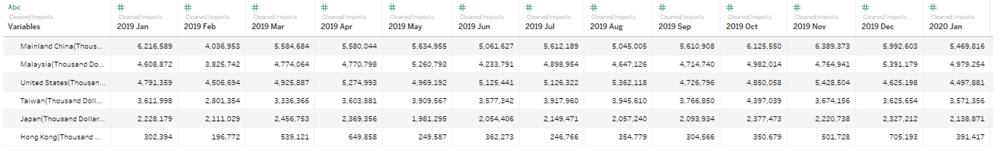{width=400px}
3.	Open tab ‘Sheet 1’ and use Tableau to pivot the table, with ‘Measure Values’ in columns and ‘Variables’ in ‘Rows’. 
{width=300px}
Remove ‘CNT’ from ‘Measure Values’ by right-click and selecting ‘remove’. 
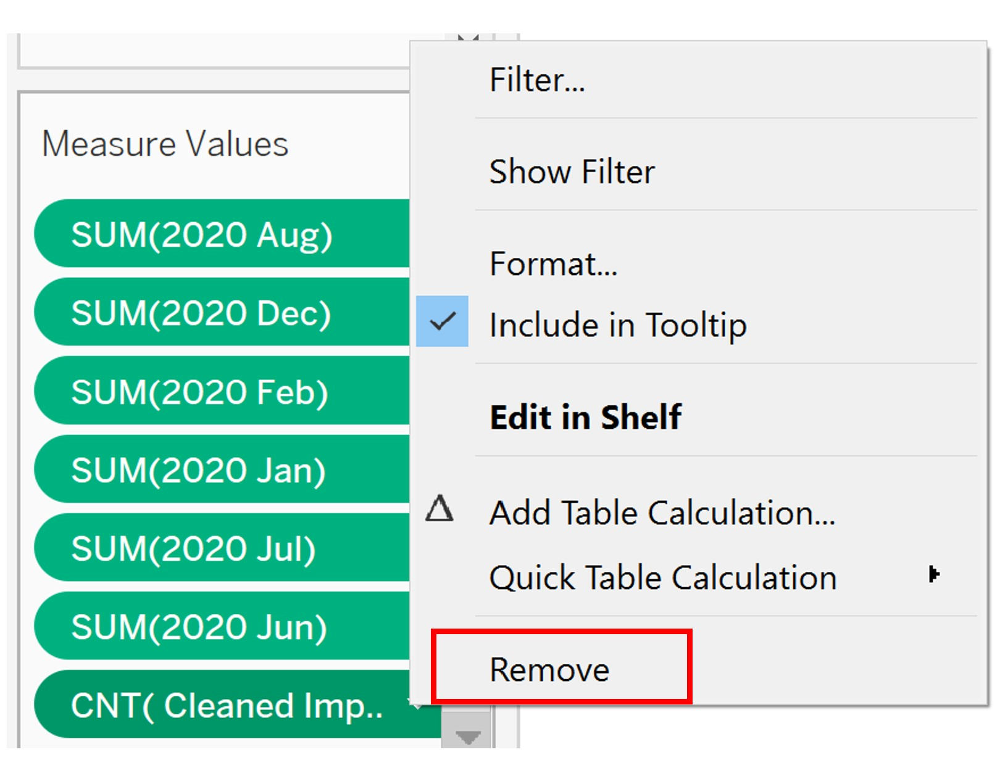{width=300px}
4.	View the pivoted table by ‘Analysis’ > ‘View Data’. 
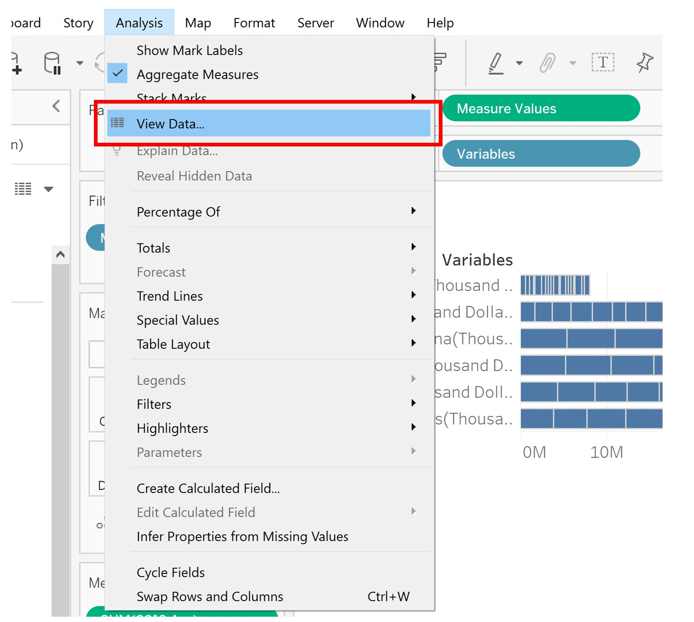{width=300px}
5.	Export the data and save the file as “Import.csv”. 
6.	Repeat steps 1 – 5 for Exports. Open the csv files in Excel, add a new column ‘Source’ to indicate if the data is for ‘Export’ or ‘Import’. 
{width=300px}
7.	Reference lines are useful so that the reader can use that to do comparisons between the charts quickly in our trellis plot. We will find the value of average Import and Export values in Excel instead of Tableau as it is a fixed value and not a field. 
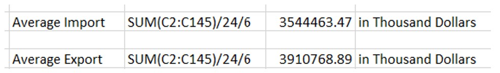{width=300px}
8.	Import the cleaned dataset into Tableau. 
## Create a Gantt Bar plot showing Export, Import and Balance of Trade by year
9.	The datatype for ‘Date’ is incorrect. Change by clicking on the icon and selecting ‘date’. 
{width=400px}
10.	Balance of trade is the difference between the value of a country’s exports and imports and is useful for assessing how Singapore’s trade partners contributes to our country’s balance of payments. 
Create a new variable to show the balance of trade. In tab ‘Sheet 1’, from ‘Analysis’ > ‘Create Calculated Field’.
{width=300px}
11.	Add ‘Date’ to ‘Columns’. Right-click on ‘YEAR(Date)’ pill to change it to ‘MONTH(Date)’. 
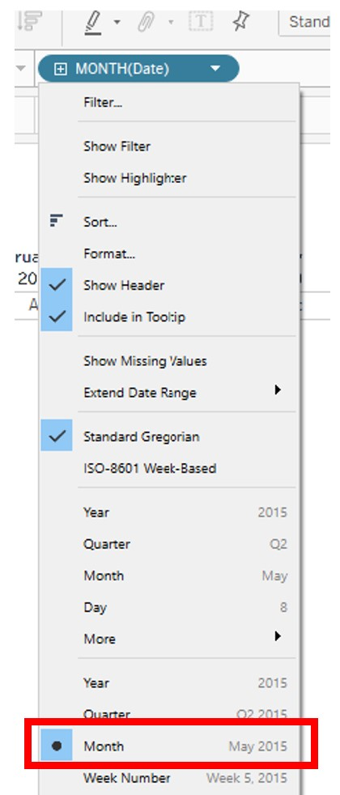{width=200px}
12.	Drag ‘Measure Values’ to ‘Rows’. In the ‘Measure Values’ panel, remove ‘CNT’ and SUM(Balance) by right-clicking and select ‘Remove’. The line graph is automatically selected. 
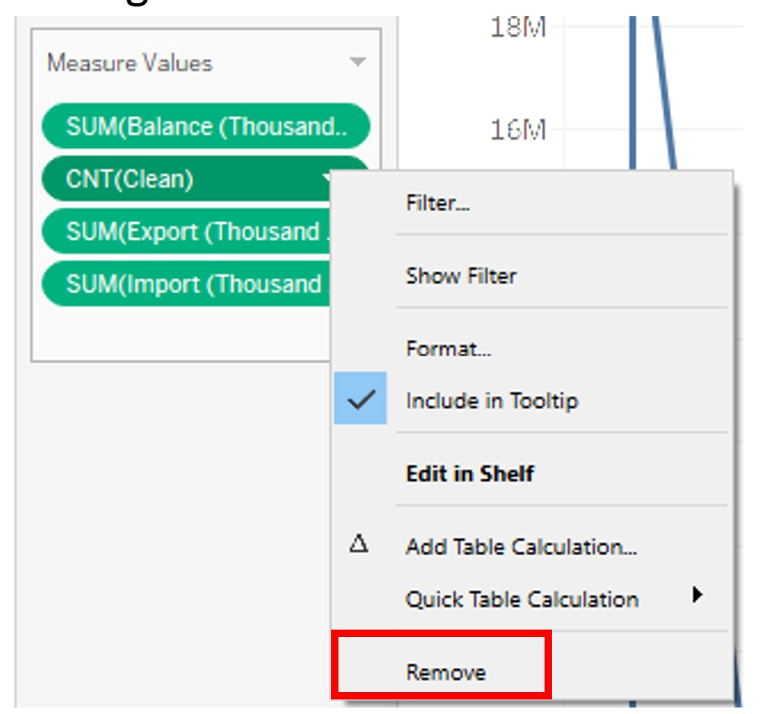{width=300px}
13.	Drag ‘Measure Names’ to ‘Color’ in the ‘Marks’ panel so that the line graphs for Export and Import are coloured differently.
{width=200px}
14.	Click on ‘color’ to customise the appearance of the line graph. 
{width=300px}
15.	Drag ‘Import’ to the front of ‘Measure Values’ in ‘Rows’. 
{width=200px}
16.	In the ‘Marks’ panel, click on ‘SUM(Import)’. Change the plot type to ‘Gantt Bar’. Drag ‘Balance’ to ‘Color’ and also to ‘Size’. 
{width=300px}
17.	As ‘Balance’ should reflect if the balance of trade for that period if positive or negative, we will customise the colour as follows: 
Click on ‘Color’ > ‘Edit Colors’. 
{width=300px}
Click on ‘Advanced’ and center the colour scale at 0 to reflect when there is positive or negative balance of trade. In the Gantt plot, red represents the period when Import exceeds Export, and blue when Export exceeds Import. 
{width=300px}
18.	We will merge the two plots by clicking on ‘Measure Values’ in ‘Rows’ and selecting ‘Dual Axis’. Next, we will click on the y-axis on the right of the plot and select ‘Synchronize Axis’. 
{width=400px}
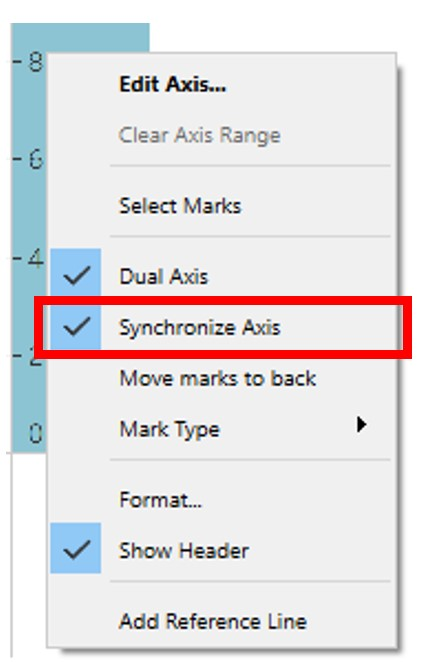{width=200px}
19.	Add the reference line to show average Export and average Import. 
Right-click y-axis and select ‘Add Reference Line’. In the field ‘Value’, select ‘SUM(Import)’. 
{width=200px}
Select a dashed line to differentiate it from the line graph and select the same colour as Import. 
20.	Drag ‘SUM(Export)’ to ‘Detail’ in the Marks panel for ‘SUM(Import)’. Right-click y-axis and select ‘Add Reference Line’. Set the parameters as follows: 
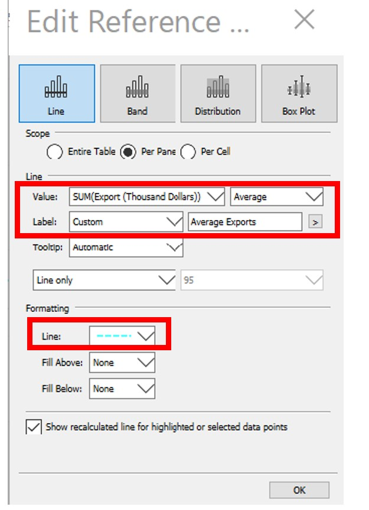{width=200px}
Select a dashed line and match the colour to the line graph for Export. 
Repeat to obtain a reference line for Balance of Trade. 
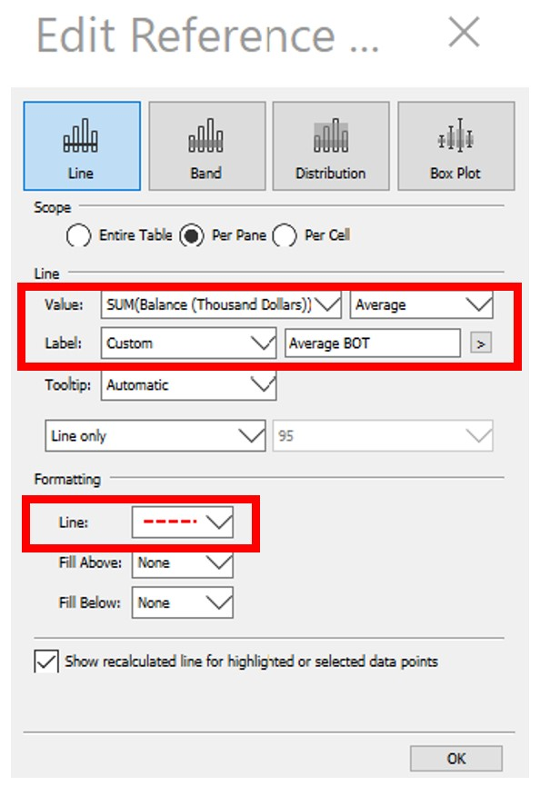{width=200px}
21.	Format reference lines. Right click on ‘Average Exports’, select ‘Format’. In the pop-up panel, set as follows:
{width=300px}
As the values from our source data are in thousand dollars, we will include ‘$’ prefix and ‘K’ suffix.
Repeat for ‘Average Imports’ and ‘Average BOT’. 
22.	Format ‘Export’, ‘Import’ and ‘Balance’ similarly. For ‘Measure Values’ in the ‘Marks’ panel, right click on ‘SUM(Export)’. Select ‘Format’.
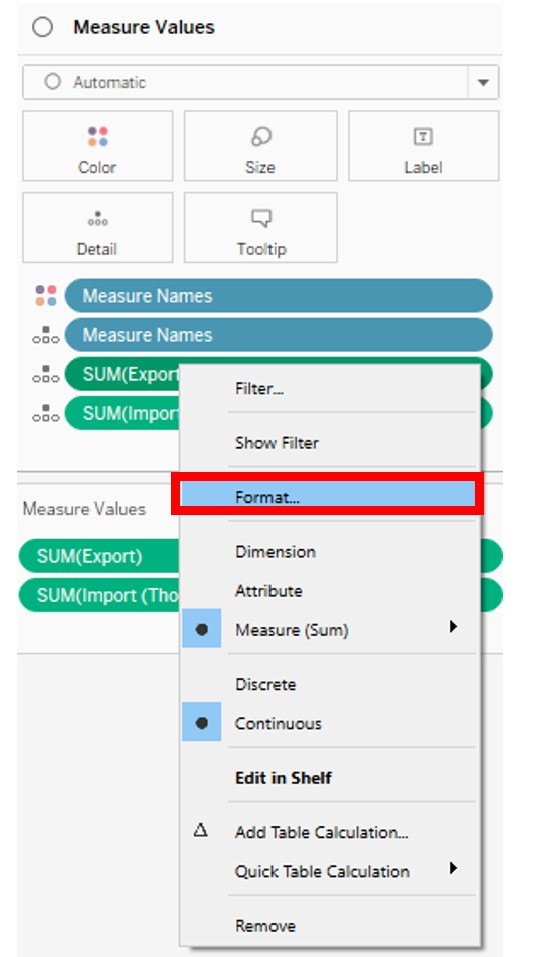{width=180px}
In the pop-up panel, select the ‘Pane’ tab. Set the values as currency as follows: 
{width=300px}
23.	Save and duplicate this as ‘Sheet 1(2)’. We will use ‘Sheet 1(2)’ to create a time series for each country. 
24.	Drag ‘Country’ to ‘Columns’. 
25.	Click on the y-axis ‘Import(Thousand Dollars)’ to sort in descending order.
26.	Edit ‘Tooltip’ for ‘SUM(Import)’ in Marks panel. Click on ‘tooltip’ and remove irrelevant fields. Append “$” and “K” to indicate that values are in thousands. 
{width=300px}
27.	To improve the aesthetic, ‘SUM(Import)’ in ‘Marks’ pane, click ‘Size’ and increase the width of the bars.
{width=200px}
Click ‘Color’ and reduce the opacity of the bars. 
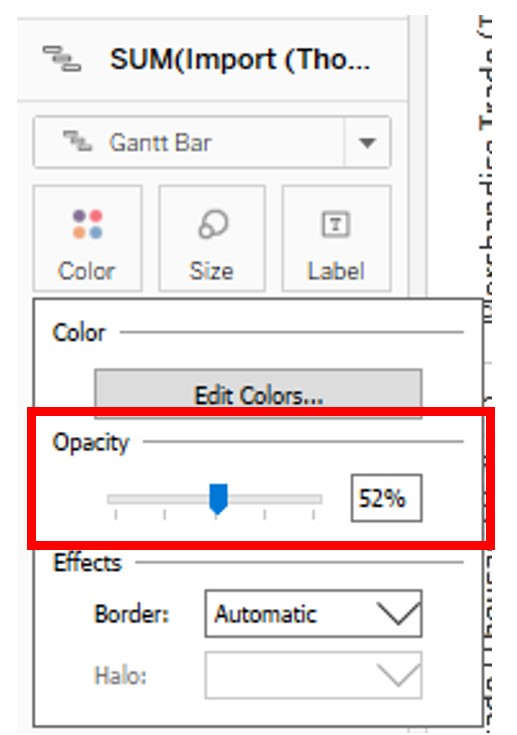{width=200px}
28.	Remove header by right-click ‘Year of Date/ Country’, select ‘Hide Field Labels for Columns’. 
{width=300px}
29.	Add a proper title. Click on the title and in the ‘Edit Title’ pop-up box, add a title and format it. 
{width=300px}
30.	Right-click on the x-axis, select ‘Format’. Make country names more visible by increasing the font size.
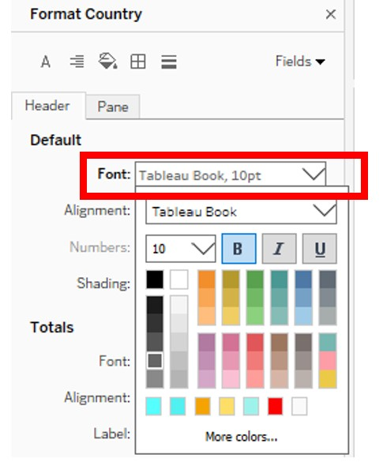{width=200px}
In the ‘Columns’ tab, add vertical grid lines so that it will be easier to tell the countries apart. 
Match the appearance of the horizontal grid lines so that they will not detract from the plots. 
{width=300px}
31.	Rename legend for ‘SUM(Balance)’ to ‘Balance of Trade’ using ‘Edit Title’. 
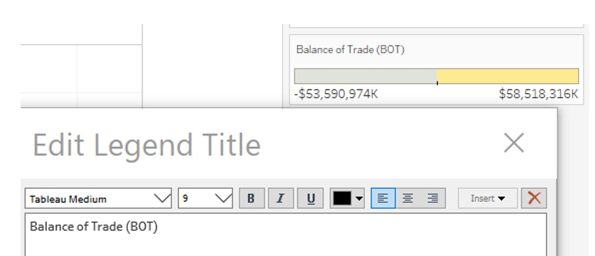{width=300px}
32.	Rename legend for ‘Measure Names’ to ‘Merchandise Trade’.
{width=300px}
33.	To show the percentage growth for Exports from 2019 to 2020. Drag ‘Export’ pill to ‘Rows’. 
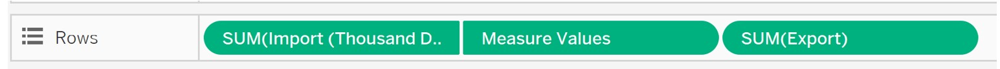{width=300px}
Click on ‘Export’, ‘Quick Table Calculation’ then ‘Percent Difference’. 
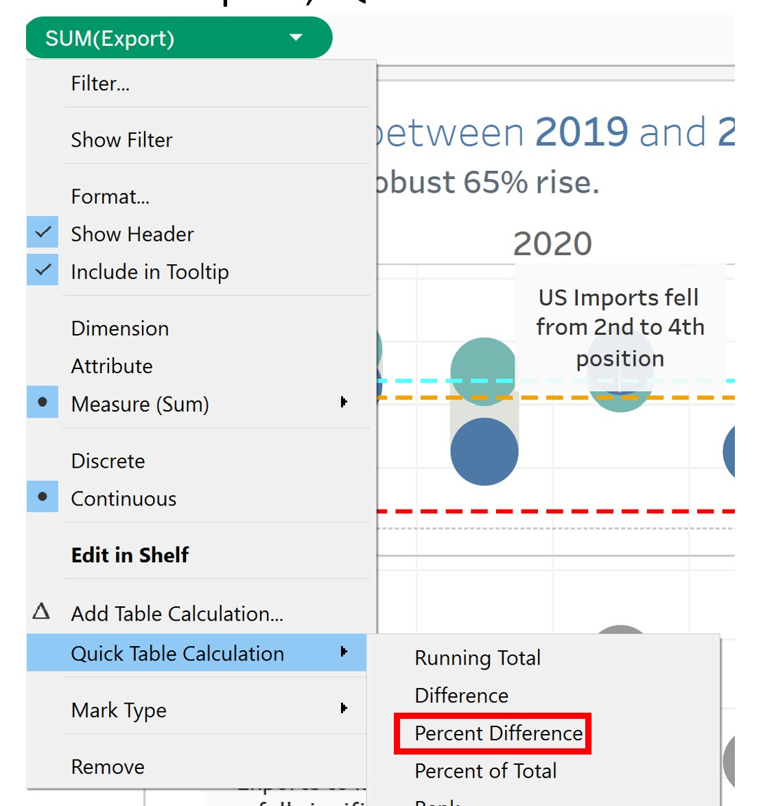{width=300px}
Click on ‘Export’ again, select ‘Compute Using’ then ‘Date’. 
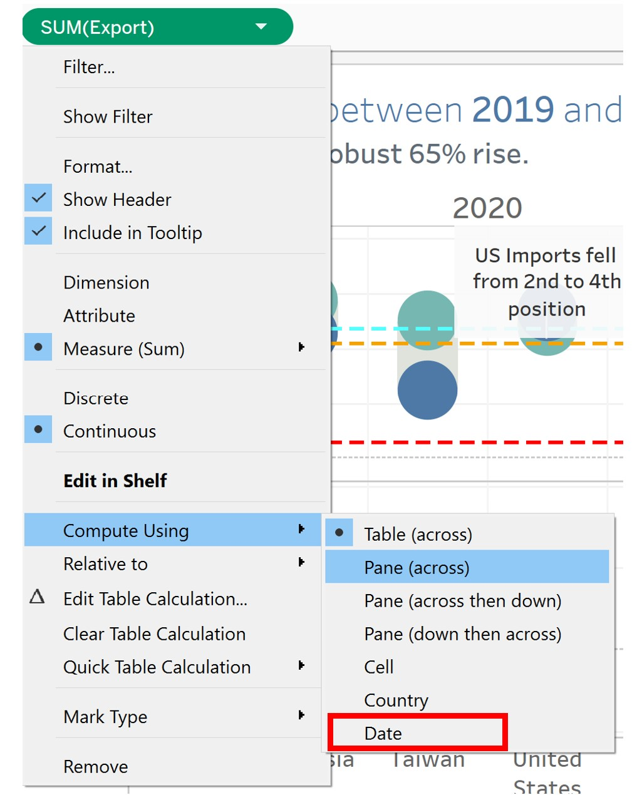{width=300px}
Double-click on ‘Export’ pill and copy the formula. 
{width=300px}
Click ‘Analysis’, ‘Create Calculated Field’. Paste the formula. 
{width=300px}