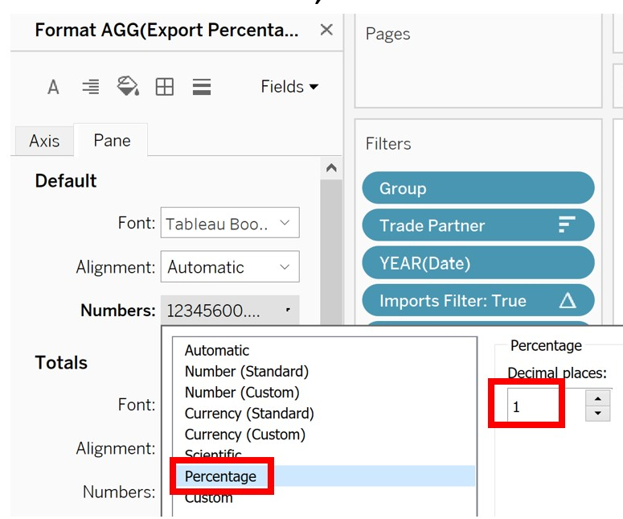

```{r setup, include=FALSE}
knitr::opts_chunk$set(echo = FALSE)
```

# 1. Introduction 
The data visualization for this makeover is created by using data provided by Department of Statistics, Singapore (DOS). In this data visualization makeover, we are tasked to explore and revise the scatter plot with bubble points shown below.


# 2. Evaluation of Original Visualisation 

We start by exploring the original visualisation in terms of **clarity** and **aesthetics**. 

## 2.1 Clarity

### Title
The title for the visualisation is missing, leaving the reader to interpret the message by themselves. The time period for the dataset is not given, making it difficult to assess which year this visualisation is for as well as whether the values shown are aggregates of a few years or of one year. 

### Axes
No units are provided for the axes. Imports are along the y-axis, but the label is placed along the side of the x-axis instead. Whereas Exports are long the x-axis, but its label is placed along the y-axis instead. The axes for a continuous variable and the scale is given but no tick marks are shown to indicate this. Tick marks on the axes would make it easier for the reader to tell the values of the Exports and Imports by reading them off the axes. 

### Chart Type
A scatter plot with large bubbles makes it difficult to compare the trade partners by Exports or Imports as the readers have to imagine where the centre points will be if they are projected onto the axes to know the rank for Exports or Imports. A better method to show the ranking would be to line the trade partners linearly for each measure.  
The plot’s background is divided into two triangles, with the upper one showing ‘Net Importer’ and the lower one showing ‘Net Exporter’. The Trade Partner is a ‘Net Importer’ when its centre point falls in the upper triangle and vice-versa for ‘Net Exporter’. However, the bubbles are large and floating above the diagonal reference line, hiding it from view. It becomes difficult to tell if the centre points for EU and Republic of Korea lies above or below the diagonal. It would be better if the bubbles were transparent so that the diagonal and centre points can be seen.  

### Size and Order of the Bubbles
The size of bubble is explained in the note as the “total merchandise trade value with the trading partner”. However this explanation does not tell the reader if they should be comparing the bubbles based on the area or the radius. Also comparison of the size of the bubbles across the chart is not easy as small differences in size is not detectable this makes it difficult to rank the countries based on the bubble size. 
The bubbles appear to overlap without any apparent order. For instance, United States with a larger bubble overlaps the smaller bubble of EU, but in another cluster, the smaller Thailand bubble overlaps the larger bubble of the Republic of Korea. Making the overlap more consistent will help the reader be able to compare the sizes of the bubbles more easily especially for clusters of bubbles of similar sizes like Japan and Republic of Korea. A suggests would be to sort the bubbles from smallest to largest, and overlap them accordingly with the largest bubble at the background. 

### Labels
The label for each bubble identifies the Trade Partners clearly. However, the value on the label is not explained leaving the reader to wonder which trade indicator is shown. This makes it harder to understand the message of the visualisation. Labels are not given a standard orientation with some labels covering the white centre points of neighbouring bubbles. 

### Annotation/ Source
A note is given to explain the significance of the size of the bubble and the white centre point. This is helpful for the reader as this is an important note, perhaps the font size could be increased so make it more readable. 
An annotated insight is given at the bottom of the chart with an ‘i’ symbol to make it standout as important. However, this insight is not drawn from interpretation of the chart as they refer to two different years 2009 and 2006. The chart does not allow for comparison across years. A suggestion would be to create a filter to allow the user to select for the time period they want to view for comparison. 
The source is mentioned. 

## 2.2 Aesthetic

### Size of the Centre Point
The white centre point is fairly large in comparison with the shaded diagonal boundary. This make it difficult to tell if Japan is a net importer or exporter accurately as the entire point rests on the boundary. Reducing the size of the centre point will make it more precise but the trade-off would be less a less visible centre point. 

### Labels
Labels are unnecessarily large and hiding and covering important information such as the centre points. Smaller labels for Trade Partners could be used and additional information on the trade metrics be placed on a pop up box instead to minimise the clutter in the chart. 
A thin dotted line is used to attach the label to the bubble. However the colour contrast is not sufficient for the dark green United States line over the dark purple EU bubble to make out this easily. It would be better to increase the transparency of the bubbles or select more contrasting colour choices. 
A small icon with a star is placed in the chart with an accompanying legend explaining that it indicates top net exporter/ importer. The icon is easy to interpret with the out arrow indicating exports and in arrow indicating imports. 

### Colours and Shading
Colours used are consistent for each country and it helps to make each bubble stand out in the chart. However the colours for Thailand and EU are too similar and it would be better if all the trade partners be given a unique colour. 
Colour consistency is maintained for the axes, axes labels and shaded triangle regions. The triangles are of a lighter shade of the axis colour. This is a subtle emphasis of the connection between the axis and the shaded region and helps to nudge the reader to interpret the chart in this light. 

### Data Ink
This chart has a high data ink ratio. 

# 3. Proposed Design

### Titles
A main title is given to set the context of the visualization. The original visualisation compares the ranking of trade partners for Exports and Imports. In line with the original visualisation, the main title will deliver this message and sub-titles will be added to provide further details about each charts to set the context for the user to explore the filters. 

### Chart Type
To compare between export and imports, a slope graph with a dual axis is used to show the rank of the trade partners in each axis. A slope graph gives a summarized view of the two measures, Exports and Imports, making comparison easier. Also each axis presents the ranks of the trade partner in a linear way to allow users to tell immediately which trade partner contributes more as a importer or exporter. 
Bar charts showing the percentage contribution of the trade partner for Exports and Imports will be created and added to the slope graph. This allows users to interpret the significance of the ranking based on the contribution to total. For example, even a small difference in Exports can make a difference to the ranking, but by looking at the percentage contribution, the user will be able to tell that the rank difference is not significant. 
Users will have access to a number of filters to allow for exploration based on year of choice, type of trade partner, number of top exporters/ importers. Filtering by year allows users to see if there are any trends. Filtering by region or country adds greater clarity to the visualisation as there will not be any overlaps in the comparisons. Ie. Asia is a region and should not be compared against countries like Malaysia and Thailand that makes it up. 
As balance of trade is a key indicator of overall trade surplus or deficit for Singapore, this measure will also be included in the chart. 

### Y-axis 
Use a synchronized dual axis to create a list of the trade partners in terms of their rankings for Exports and Imports. This is an advantage over the scatter diagram where it is difficult to compare over two axes. Using slope lines makes comparison of the rank clear. 

### Filters
The two main filters for Year and Region/ Country will be placed at the top of the chart to nudge users to use them first. On the right will be two filters for Exports and Imports for users to further explore the aspects of the visualization. Simple instructions will be provided explain the filters. 
 
### Annotation/ Source
Some annotation will be provided to give some suggestion for filter settings to help the user to get started. 
The source will be provided at the bottom of the chart. 

### Legend
A legend will be placed at the bottom of the chart to help users interpret the chart. 

### Chart Order and Sizing
The charts will have their tooltips, labels and filters synchronised so that it is intuitive for the users and easy to obtain the results from either chart. The charts will be sized and sorted such that each row represents a trade partner and results can be read across the rows. As there are many filters, the visualisation will be kept simple so that each change will be obvious for easy comparison. 

### Colours and Shading
Instead of a diagonal boundary, this design makes use of diverging red-blue colours of the lines to indicate net importer or exporter, with darker colour indicating a higher value. The different colours make identifying the net importer or exporters more obvious. 
Dedicated colours will be assigned to each field (Export, Imports, Balance of Trade) to make it user friendly and consistent. There will be no shading at the background to distract the user from the visualization.  

### Labels and Tooltip pop-ups
Labels will be used to mark out the trade partners, percentages and rankings directly as these are the key information that should be keep on display all the time so that users can quickly compare them. To prevent overcrowding, the labels will be small and simple. Tooltips that pop-up will be used to provide further details for users to explore. 

#  4. Data Preparation in Excel and Tableau
1.	Download the file from Department of Statistics, Singapore (DOS) under the sub-section of Merchandise Trade by Region/Market at the following link  https://www.singstat.gov.sg/find-data/search-by-theme/trade-and-investment/merchandise-trade/latest-data
2.	Open the file in Excel. In the downloaded file ‘outputFile.xlsx’, sheet‘T1’ contains ‘Imports’ and ‘T2’ contains ‘Exports’ and we will rename the tabs as such. As the study period should be between January 2011-December 2020, we will delete the years not included in this range and also remove all headers and footers from each sheet. Save the file. 
3.	Open Tableau. Import the Excel file into Tableau by selecting ‘Microsoft Excel’ under the ‘Connect’ panel.  
{width=250px}
4.	In the ‘Data Source’ tab, drag ‘Exports’ to the workspace to view the contents.  
{width=400px}
5.	As the table is too long, we will pivot the columns containing dates as headers. Select the first date column ‘2011 Jan’ and hold down shift-key, scroll to the last date column ‘2020 Dec’ and select it. All the dates column are now highlighted.
Click on the black triangle in ‘2020 Dec’ and select ‘Pivot’.  
{width=300px}
6.	The dates are all now in rows.  
{width=300px}
Click on the name of each column to rename. We will rename the columns as follows:  
{width=300px}
Click on the data type ‘Abc’ to change the data type. Date type for ‘Date’ is ‘Date’ and ‘Export’ is ‘Number(decimal)’.  
{width=300px}
7.	To obtain only the Trade Partner name in each row, we click the black triangle in ‘Variables’ and select ‘Custom Split’.  
{width=300px}
Extract the Trade Partner name using the following:  
{width=300px}
Extract the units ‘Millions’ or ‘Thousands’ by applying ‘Custom Split’ again:  
{width=300px}
After splitting, we will rename ‘Variables – Split 1’ as ‘Trade Partner’ and ‘Variables – Split 2’ as ‘Units’.   
{width=300px}
8.	Export this dataset to Excel. Go to tab ‘Sheet1’ in ‘Data’, select ‘Exports(outputFile’), then ‘Export Data to CSV’, ‘Exports’. The file is saved as ‘Exports (outputFile)_Exports.csv’.  
{width=300px}
9.	Go back to tab ‘Data Source’. Remove ‘Exports’ file.  
{width=300px} 
10.	Drag ‘Imports’ sheet into the workspace and repeat steps 4 to 8 to pivot and rename column and data type. 
Save this file as “Exports (outputFile)_Imports.csv”. 
11.	Open both files in Excel to view. Observe that the trading partners with trade listed as ‘Million dollars’ are regions.   
{width=300px} 
To indicate this, we will rename ‘Million’ in the ‘Variable Split 2’ column as ‘Region’ and ‘Thousand’ as ‘Country’ in Excel. 
{width=300px} 
12.	Convert all the Import and Export values into millions by dividing the values in thousands by 1000.    
{width=300px} 
13.	Relabel the following trade partner names to the more commonly used terms:  
{width=300px} 
Use Excel ‘Find and Replace’.   
{width=300px}
14.	Save both files into the same Excel spreadsheet as “Exports (outputFile).xlsx”. 
Import into Tableau as before. 
15.	To join the two worksheets together, drag ‘Exports (outputFile)_Exports.xlsx’ into the work space and click on the black triangle.
{width=300px}
Select ‘Open’ and drag ‘Exports (outputFile)_Imports.xlsx’ beside it. Click on the join icon and select ‘Full Outer’ as we want to keep the entries from both datasets. 
{width=300px}
In the pull down, we will match the fields for the joins, matching ‘Trade Partner’, ‘Date’ and ‘Group’. {width=300px}
16.	Delete the duplicated columns. Note that Singapore has more importing trade partners than exporting so there are some null values for exports. The final cleaned dataset:  
{width=300px}
## Create the Slope Graph
17.	Go to worksheet ‘Sheet 1’, create a new variable ‘Balance of Trade’ to show the difference between the trade partners Export and Import value. In ‘Analysis’, select ‘Create Calculated Field’ and enter the following:  
{width=300px}
18.	Next, create two new fields to calculate the rank of the Trade Partners.
In ‘Analysis’ select ‘Create Calculated Field’.  
{width=200px}
Enter the following:   
{width=200px}
19.	Drag ‘Measure Names’ to ‘Columns’ and ‘Measure Values’ to ‘Rows’.   
{width=200px}
20.	In ‘Marks’ change the chart display to ‘Line’.   
{width=200px}
21.	Drag ‘Trade Partner’ to ‘Detail’ in ‘Marks’ panel. 
{width=200px}
22.	In ‘Measure Values’ remove ‘CNT(Exports(outputFile).csv)’ , ‘SUM(Exports)’, ‘SUM(Imports)’ and ‘SUM(Balance of Trade)’ as they are not useful for our chart.  
{width=200px}
For each of the remaining three ranked measures in ‘Measure Values’, right-click on each and select ‘Compute Using’ then ‘Trade Partner’.  
{width=400px}
23.	Right-click on the y-axis ‘Value’ and select ‘Edit axis’.  
{width=200px}
Check ‘Reversed’ as we want to display Trade Partners from the top.  
{width=200px}
24.	Improve the aesthetics of the visualisation. 
Click on ‘Size’ in the ‘Marks’ panel and select the thinnest width for the lines.   
{width=100px}
Drag ‘Measure Value’ and ‘Trade Partner’ to ‘Label’ and click on it. Check ‘Show mark labels’ and ‘Line Ends’. 
{width=200px}
Next, click on ‘Text’ and use the ‘Insert’ drop-down to format the label. Use a different colour for the rank.  
{width=400px}
Right-click on ‘Export- Rank’ in the ‘Measure Values’ panel, select ‘Format’.  
{width=200px}
In the ‘Pane’ panel, select ‘Numbers’ and select ‘Number (Standard)’.  
{width=200px}
Repeat for ‘Import-Rank’ and ‘Balance of Trade- Rank’ to change the displayed rank into an integer. 
25.	As there are currently too many Trade Partners displayed, the visualisation is too cluttered for meaningful exploration. Reduce the number of Trade Partners by creating a filter for users to select the Trade Partners they want to view. Drag ‘Export- Rank’, ‘Import- Rank’ and ‘Balance of Trade – Rank’ to ‘Filters’. In Filter dialogue box, select ‘At most’ so that a slider which is fixed at the start end will be created.   
{width=200px}
To view the filter, right-click on ‘Export- Rank’ in the ‘Filters’ panel and select ‘Show Filter’.  
{width=200px}
The filter will appear on the right of the chart.   
{width=200px}
Click on the small black arrow on ‘AGG(Export – Rank)’ and select ‘Edit Title’.   
{width=200px}
Change the title as follows:  
{width=400px}
Repeat the steps to create similar filter for ‘Import-Rank’. 
{width=200px}
For ‘Balance of Trade – Rank’, select ‘Range of Value’ option for the filter so that users can explore trade partners with negative trade balance.   
{width=200px}
26.	Create a filter for Year. Drag ‘Date’ into ‘Filters’. Select all the years and select ‘Show Filter’ to display it.  
{width=200px}
Format the year filter by clicking on the black triangle and select ‘Single Value (slider)’.  
{width=200px}
Select ‘Edit Title’ to change the displayed title as follows:  
{width=400px}
27.	Drag ‘Balance of Trade’ to ‘Colour’ in the ‘Marks’ panel and click on it.   
{width=200px}
Select ‘Edit Colors’ and by using red to denote negative Balance of Trade and blue to denote positive Balance of Trade, center the diverging colour palette at 0.   
{width=300px}
28.	Remove grid lines from the graph so that it will not distract users from the Slope graph. 
In ‘Format’, select ‘Lines’. Under the ‘Rows’ tab, select ‘None’ for ‘Grid Lines’. 
{width=200px}
29.	Remove the y-axis by clicking on ‘Value’ and uncheck ‘Show Header’.   
{width=200px}
30.	Right-click on the header along the x-axis, select ‘Edit Alias’.  
{width=200px}
Rename the header in the pop-up dialogue box.  
{width=300px}
Repeat for Import and Balance of Trade.
31.	Drag ‘Export- Rank’ , ‘Import-Rank’ and ‘Balance of Trade- Rank’ to ‘Tooltip’ in the ‘Marks’ panel. Click on ‘Tooltip’ and use different colours for each measure.   
{width=300px}
32.	Double-click on the title ‘Sheet 1’ and give the chart a title.   
{width=300px}
33.	Create a new sheet to show the proportion of trade each trade partner contributes to the total. 
Click on the icon to create a new sheet.
Drag ‘Trade Partner’ to ‘Columns’ and ‘Export’ to ‘Rows’. Right click on ‘Export’ and select ‘Quick Table Calculations’ and ‘Percent of Total’.  
{width=200px}
Right click on ‘Export’ again and select ‘Compute Using’ then ‘Trade Partner’.  
{width=200px}
Right click on ‘Export’ again and select ‘Format’. In the ‘Pane’ tab, under ‘Numbers’, select ‘Percentage’ and format as follows:  
{width=300px}
Double click on ‘SUM(Export)’ in ‘Rows’ the formula will appear.   
{width=300px}
Copy it and paste it in a new ‘Create Calculated Field’ dialogue.   
{width=300px}
Right-click on ‘Trade Partner’ and select ‘Sort’.  
{width=100px}
In the pop-up sort by ‘Field’ and ‘Exports’ in Descending order.   
{width=200px}
This is the current view: 
{width=200px}
34.	Click on the icon to swap the orientation of the barchart.   
{width=400px}
35.	Next, we want to create a filter that will apply to all worksheets to filter based on the rank of Exports. (Currently the filters for Exports/ Imports and Balance of Trade do not have the ‘Apply to worksheets’ options in the pull down.)
Right-click anywhere in the ‘Data’ panel and select ‘Create Parameter’.  
{width=200px}
From the previous worksheet, we know that there are 88 Exporter to filter, hence we will set the range of the new parameter to be up to 88 as follows:  
{width=200px}
36.	In ‘Analysis’, select ‘Create Calculated Field’ and create a new field that will give values less than the parameter value selected.   
{width=200px}
Drag this new field to ‘Filters’ and set it to be always ‘True’.  
{width=200px}
In the ‘Parameters’ panel, right-click on ‘Exports Range’ and select ‘Show Parameter’.  
{width=100px}
A filter will pop up allow for the visualisation to be filtered by the Export ranks across all worksheets.  
{width=100px}
37.	Repeat the steps 34 to 37 to create a similar filter for Imports in a new sheet. 
38.	Navigate back to the worksheet with the filtered barchart. Drag the following filters into the ‘Filters’ panel. The settings are the same as previous (‘All’ for Group, Trade Partner and Year(Date)).     
{width=200px}
39.	To format the appearance of the barchart in the ‘Marks’ panel, we will drag ‘Export Percentage of Total’ to ‘Color’. 
Drag ‘Trade Partner’ and ‘Export Percentage of Total’ to ‘Label’. Right-click on ‘Export Percentage of Total’ and select ‘Format’.   
{width=200px}
In the ‘Pane’ tab, format the number as follows:   
{width=200px}
Drag ‘Trade Partner’, ‘Export-Rank’, ‘Import-Rank’ and ‘Balance of Trade – Rank’ to ‘Tooltip’. We will format ‘Tooltip’ the same as for the previous worksheet for consistency.   
{width=400px}
40.	Repeat step 40 to format the worksheet for the Imports bar chart. 
41.	Navigate back to the Exports bar chart, right-click on the x-axis and select ‘Edit Axis’.  
{width=100px}
Under ‘Scale’ select Reversed’.   
{width=300px}
The chart will look like this:   
{width=200px}
42.	Before creating the final visualisation in dashboard, synchronise all the filters by clicking on the black triangle of each and select ‘Apply to worksheet’, then ‘All using this Data Source’.  
{width=100px}
Going to the Slope Graph in ‘Sheet 1’, we will remove the earlier filters for ‘Export-Rank’,  ‘Import-Rank’ and ‘Balance of Trade- Rank’ and add ‘Imports Filter – True’ and ‘Exports Filter – True’ to the ‘Filters’ panel.   
{width=200px}
43.	Create a new dashboard and drag ‘Horizontal’ from ‘Objects’ to fill the whole space. 
Drag our first worksheet ‘Sheet 1’ into the space and add the bar chart for Exports to the left and the bar chart for Imports to the left of it. 
Hide all titles and headers by right-clicking on them and selecting ‘Hide..’. 
Make it easier for the user we will adjust the heights of the three charts to match up row wise so that it is easier to read. Click on each worksheets and select ‘Fit Height’.   
{width=100px}
44.	Make some small tweak by adjusting the spacing so that the visualisation lies ups. Change the colours of the bar charts to differentiate between Exports and Imports, selecting the same colour as the Tooltip display for consistency. A quick way to do this is to click on the colour in ‘Tooltip’ and save it as a custom colour so that it wall appear in the palette for ‘Color’.   
{width=300px}
45.	Add in the titles for each graph as will as a main title by dragging ‘Text’ into the dashboard space.   
{width=200px}
Add some suggestions for exploring the data as well as the source using ‘Text’. 
46.	The complete visualization:   
{width=400px}

# Major Observations 
## 1.	Top Importers
In 2020, an average of 62% of all products imported by Singapore are from Asia. This is unsurprising as 8 out of the top 15 countries ranked by Imports in 2020 are from Asia. In 2020, the top 15 importing countries by import value are : Mainland China (14.7%), Malaysia (12.9%), Taiwan (11.3%), United States (10.9%), Japan (5.6%), South Korea (4.8%), Indonesia (4.3%), France (3.2%), Thailand (3.0%), Germany (2.7%), United Kingdom (2.5%), Philippines (2.1%) , UAE (1.9%) and Switzerland (1.8%). 
{width=400px}
Based on the Slope Graphs, we see that the top few countries do not have very steep slopes, indicating that the group of top Exporters and Importers are the same. Among the top 5 importers, we see that Mainland China has overtaken Malaysia as the top importing country since 2013. 
The slope lines are steeper for countries ranked further down the list, indicating a bigger difference in the ranks of Exports and Imports. These countries are mostly from Europe and the red lines indicates that Singapore has a trade deficit with them for 2020. Of note is also Taiwan with the darkest red line, this indicates that Taiwan is the top net importer with the largest Balance of Trade deficit. 
By filtering by other years, we see that 2020 was an unusual year for trade with the United States. It was the first year where there was a trade surplus with the United States (slope line changed from red to blue). This could be due to the fall in Imports coupled by a rise in Exports from 2019 to 2020. 

We also see that the top importing countries have remained consistent over the years (2011 to 2020). There are two dominant groups, oil producing countries like the Gulf States and Venezuela, and electronic parts manufacturing countries like Mainland China, Taiwan, South Korea and Japan. 
## 2. 2.	Top Exporters
Asia buys on average, around 36% of all exports from Singapore from 2011 to 2020. The top 5 exporting countries buys over 50% of all exports in 2020 and they are Mainland China (13.3%), Hong Kong SARc (12.2%), Malaysia (11.7%) Indonesia (9.0%) and the United States (7.0%). Of these, Hong Kong SARc has the darkest blue line indicating that it is the top net exporter. Filtering for other years, we see that Hong Kong has consistently been one of the top 3 Exporters, with a very steep slope line indicating a large drop of about 20 positions between its Exports rank and Imports rank.
(2.7%), United Kingdom (2.5%), Philippines (2.1%) , UAE (1.9%) and Switzerland (1.8%). 
{width=400px}
Filtering by years, we see that Mainland China has overtaken Malaysia as the top Exporting country since 2014 where the different in their percentage of total exports was less than 1%. In 2020, Malaysia has fallen to 4th position for Exports and with a 5% difference in total exports with Mainland China. 


